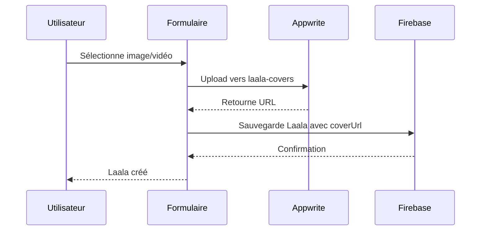
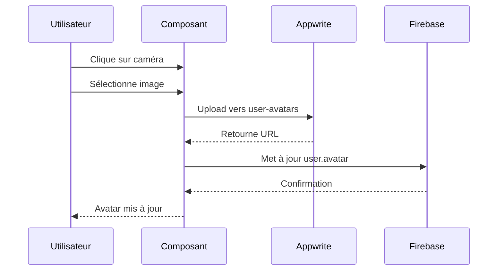

# Intégration Appwrite + Firebase pour La-à-La Dashboard

Cette documentation explique l'intégration complète entre Appwrite (pour les médias) et Firebase (pour les données) dans le projet La-à-La Dashboard.

## 🎯 Objectif

- **Firebase Firestore** : Stockage des données (utilisateurs, laalas, contenus, boutiques)
- **Appwrite Storage** : Stockage des médias (images, vidéos)
- **URLs Appwrite** : Stockées dans Firestore pour lier les médias aux données

## 🏗️ Architecture

```
┌─────────────────┐    ┌─────────────────┐    ┌─────────────────┐
│   Frontend      │    │   Appwrite      │    │   Firebase      │
│   (Next.js)     │    │   (Médias)      │    │   (Données)     │
├─────────────────┤    ├─────────────────┤    ├─────────────────┤
│ • Formulaires   │───▶│ • user-avatars  │    │ • users         │
│ • Upload UI     │    │ • laala-covers  │    │ • laalas        │
│ • Preview       │    │ • contenu-media │    │ • contenus      │
│ • Validation    │    │ • boutique-imgs │    │ • boutiques     │
└─────────────────┘    └─────────────────┘    └─────────────────┘
                                ▲                       ▲
                                │                       │
                                └───── URLs stockées ───┘
```

## 📁 Structure des Fichiers

```
lib/appwrite/
├── appwrite.js                 # Configuration de base
├── media-service.ts            # Service principal pour les médias
├── firebase-integration.ts     # Intégration Firebase + Appwrite
└── setup-instructions.md       # Instructions de configuration

components/
├── ui/
│   ├── media-upload.tsx        # Composant d'upload réutilisable
│   └── progress.tsx            # Barre de progression
└── forms/
    ├── LaalaCreateForm.tsx     # Formulaire Laala avec upload couverture
    ├── ContenuCreateForm.tsx   # Formulaire contenu avec upload média
    ├── UserAvatarUpload.tsx    # Upload avatar utilisateur
    └── BoutiqueCreateForm.tsx  # Formulaire boutique avec images

hooks/
└── useMediaUpload.ts           # Hooks React pour l'upload

scripts/
└── setup-appwrite.js           # Script de configuration automatique
```

## 🚀 Fonctionnalités Implémentées

### 1. Upload d'Avatar Utilisateur
- **Composant** : `UserAvatarUpload.tsx`
- **Bucket** : `user-avatars`
- **Formats** : JPG, PNG, GIF, WebP
- **Taille max** : 5MB
- **Fonctionnalités** :
  - Preview en temps réel
  - Validation automatique
  - Compression optimisée
  - Interface intuitive avec bouton caméra

### 2. Couverture de Laala
- **Composant** : `LaalaCreateForm.tsx`
- **Bucket** : `laala-covers`
- **Formats** : Images + Vidéos (MP4, AVI, MOV)
- **Taille max** : 50MB
- **Fonctionnalités** :
  - Choix image/vidéo
  - Preview selon le type
  - Génération automatique de miniatures

### 3. Médias de Contenu
- **Composant** : `ContenuCreateForm.tsx`
- **Bucket** : `contenu-media`
- **Formats** : Images + Vidéos
- **Taille max** : 100MB
- **Fonctionnalités** :
  - Upload selon le type de contenu
  - Couverture optionnelle pour vidéos
  - Gestion des hashtags
  - Preview adaptatif

### 4. Images de Boutique
- **Composant** : `BoutiqueCreateForm.tsx`
- **Bucket** : `boutique-images`
- **Formats** : Images uniquement
- **Taille max** : 10MB
- **Fonctionnalités** :
  - Image de couverture principale
  - Galerie d'images additionnelles
  - Gestion multiple avec preview
  - Suppression individuelle

## 🔧 Configuration Requise

### 1. Variables d'Environnement

Ajoutez à votre `.env.local` :

```env
# Appwrite (déjà configuré)
NEXT_PUBLIC_APPWRITE_ENDPOINT=https://nyc.cloud.appwrite.io/v1
NEXT_PUBLIC_APPWRITE_PROJECT_ID=688f85190004fa948692

# Pour le script de setup (optionnel)
APPWRITE_API_KEY=your_admin_api_key_here
```

### 2. Installation des Dépendances

```bash
# Appwrite SDK (déjà installé)
npm install appwrite

# Dépendances UI (si manquantes)
npm install @radix-ui/react-progress
```

### 3. Configuration des Buckets

**Option A : Script automatique**
```bash
# Avec votre clé API admin
APPWRITE_API_KEY=your_key node scripts/setup-appwrite.js setup

# Test des buckets
node scripts/setup-appwrite.js test
```

**Option B : Manuel**
Suivez les instructions dans `lib/appwrite/setup-instructions.md`

## 💻 Utilisation

### 1. Upload d'Avatar

```tsx
import UserAvatarUpload from '@/components/forms/UserAvatarUpload';

function ProfilePage() {
  const handleAvatarUpdate = (newAvatarUrl: string) => {
    // Mettre à jour l'avatar dans Firebase
    updateUserInFirestore(userId, { avatar: newAvatarUrl });
  };

  return (
    <UserAvatarUpload
      currentAvatar={user.avatar}
      userName={user.nom}
      onAvatarUpdate={handleAvatarUpdate}
    />
  );
}
```

### 2. Création de Laala avec Couverture

```tsx
import LaalaCreateForm from '@/components/forms/LaalaCreateForm';

function LaalaPage() {
  const handleLaalaSubmit = async (laalaData) => {
    // Les données incluent coverUrl et coverType
    const response = await fetch('/api/laalas', {
      method: 'POST',
      body: JSON.stringify(laalaData)
    });
  };

  return (
    <LaalaCreateForm
      isOpen={isFormOpen}
      onClose={() => setIsFormOpen(false)}
      onSubmit={handleLaalaSubmit}
      creatorId={currentUser.id}
    />
  );
}
```

### 3. Hook Personnalisé

```tsx
import { useUserAvatarUpload } from '@/hooks/useMediaUpload';

function CustomUpload() {
  const { upload, isUploading, progress, error } = useUserAvatarUpload(
    (avatarUrl) => console.log('Avatar uploadé:', avatarUrl)
  );

  const handleFileSelect = (file: File) => {
    upload(file);
  };

  return (
    <div>
      {isUploading && <p>Upload: {progress}%</p>}
      {error && <p>Erreur: {error}</p>}
    </div>
  );
}
```

## 🔄 Flux de Données

### 1. Création d'un Laala avec Couverture



### 2. Upload d'Avatar



## 🛡️ Sécurité et Validation

### 1. Validation Côté Client

```typescript
// Validation automatique dans media-service.ts
const validation = AppwriteMediaService.validateFileForContent(file, 'user-avatar');
if (!validation.valid) {
  throw new Error(validation.error);
}
```

### 2. Permissions Appwrite

```javascript
// Configuration des permissions
Permission.read(Role.any()),        // Lecture publique
Permission.create(Role.users()),    // Création pour utilisateurs connectés
Permission.update(Role.users()),    // Modification par le propriétaire
Permission.delete(Role.users())     // Suppression par le propriétaire
```

### 3. Nettoyage des Fichiers

```typescript
// Suppression automatique lors de la mise à jour
await FirebaseAppwriteIntegration.cleanupOldMedia(
  [oldFileId], 
  'USER_AVATARS'
);
```

## 📊 Monitoring et Maintenance

### 1. Surveillance des Uploads

```typescript
// Logs automatiques dans tous les services
console.log('📤 Upload démarré:', { fileName, fileSize, bucketType });
console.log('✅ Upload terminé:', { fileId, url });
console.log('❌ Erreur upload:', { error, fileName });
```

### 2. Métriques Importantes

- Taille totale des fichiers par bucket
- Nombre d'uploads par jour
- Taux d'erreur des uploads
- Temps moyen d'upload

### 3. Nettoyage Périodique

```bash
# Script de nettoyage des fichiers orphelins (à implémenter)
node scripts/cleanup-orphaned-files.js
```

## 🚨 Dépannage

### Erreurs Communes

1. **"Bucket not found"**
   ```bash
   # Vérifier les buckets
   node scripts/setup-appwrite.js test
   ```

2. **"Permission denied"**
   - Vérifiez les permissions des buckets
   - Assurez-vous que l'utilisateur est connecté

3. **"File too large"**
   - Vérifiez les limites de taille
   - Implémentez une compression côté client

4. **"Invalid file type"**
   - Vérifiez les extensions autorisées
   - Validez le MIME type

### Debug Mode

```typescript
// Activer les logs détaillés
localStorage.setItem('appwrite-debug', 'true');
```

## 🔮 Évolutions Futures

### 1. Optimisations Prévues

- Compression automatique des images
- Génération de miniatures multiples
- Upload en arrière-plan
- Cache intelligent des médias

### 2. Fonctionnalités Avancées

- Transformation d'images à la volée
- Watermarking automatique
- Détection de contenu inapproprié
- Analytics d'usage des médias

### 3. Performance

- CDN pour la distribution
- Lazy loading des images
- Progressive loading des vidéos
- Optimisation mobile

## 📞 Support

Pour toute question sur cette intégration :

1. Consultez la documentation Appwrite : https://appwrite.io/docs
2. Vérifiez les logs dans la console du navigateur
3. Testez avec le script de diagnostic : `node scripts/setup-appwrite.js test`
4. Consultez les exemples dans les composants existants

---

**Note** : Cette intégration respecte la logique existante du projet et ajoute simplement la gestion des médias via Appwrite, tout en conservant Firebase pour les données structurées.