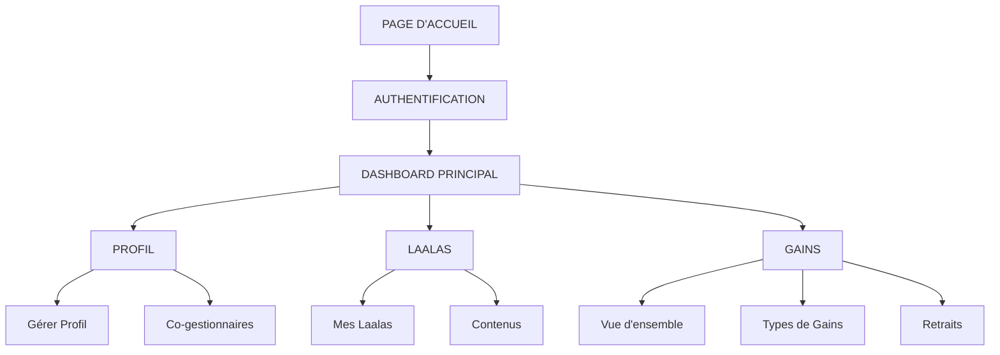

# Plan de Navigation - Plateforme Dashboard

## Instructions pour l'IA de génération d'image :
**Créer un diagramme de flux (flowchart) avec des boîtes rectangulaires reliées par des flèches. Utiliser des couleurs différentes pour chaque section principale. Style moderne et professionnel.**

---

## 🚀 POINT D'ENTRÉE

```
[PAGE D'ACCUEIL]
       ↓
[AUTHENTIFICATION]
```

### Authentification
- **Connexion Utilisateur Principal**
- **Connexion Co-gestionnaire** 
- **Inscription Nouvelle Compte**
- **Compléter Profil**

---

## 🏠 DASHBOARD PRINCIPAL

```
[AUTHENTIFICATION] → [DASHBOARD PRINCIPAL]
```

### Vue d'ensemble
- **Statistiques générales**
- **Résumé des activités**
- **Notifications**
- **Navigation principale**

---

## 👤 SECTION PROFIL

```
[DASHBOARD] → [PROFIL]
```

### Gestion Profil Personnel
- **Modifier Informations** (nom, email, téléphone)
- **Changer Photo de Profil**
- **Paramètres de Sécurité**
- **Préférences**

### Gestion Co-gestionnaires
- **Créer Co-gestionnaire**
- **Modifier Permissions**
- **Activer/Désactiver**
- **Historique d'Actions**

---

## 🎯 SECTION LAALAS

```
[DASHBOARD] → [LAALAS]
```

### Gestion des Laalas
- **Créer Nouveau Laala**
- **Modifier Laala Existant**
- **Supprimer Laala**
- **Paramètres de Visibilité**

### Gestion des Contenus
- **Créer Contenu** (image/vidéo)
- **Modifier Contenu**
- **Gérer Galeries**
- **Programmer Publications**

---

## 💰 SECTION GAINS

```
[DASHBOARD] → [GAINS]
```

### Vue d'ensemble des Gains
- **Gains Totaux**
- **Gains du Mois**
- **Statistiques Détaillées**

### Types de Gains
- **Gains Directs** (commissions directes)
- **Gains Indirects** (commissions réseau)
- **Gains Publicitaires** (revenus ads)
- **Gains Couries** (livraisons)

### Gestion des Retraits
- **Demander Retrait**
- **Historique Retraits**
- **Statut des Demandes**
- **Méthodes de Paiement**

---

##  FLUX DE NAVIGATION PRINCIPAL



---

## 🎨 CODES COULEURS SUGGÉRÉS

- **🔴 Authentification** : Rouge (#FF4444)
- **🟢 Dashboard Principal** : Vert (#44AA44)
- **🔵 Profil** : Bleu (#4444FF)
- **🟡 Laalas** : Jaune/Orange (#FFB444)
- **🟢 Gains** : Vert foncé (#228B22)

---

## 📋 LÉGENDE DES INTERACTIONS

- **→** : Navigation directe
- **↓** : Flux séquentiel
- **↔** : Navigation bidirectionnelle
- **⚡** : Action rapide
- **🔒** : Accès restreint (permissions)
- **📊** : Données/Statistiques
- **💰** : Transactions financières
- **👤** : Gestion utilisateurs

---

*Ce plan représente toutes les sections principales où l'utilisateur interagit avec le système. Chaque section contient des sous-fonctionnalités spécifiques permettant une gestion complète de la plateforme.*
