# 👥 DIAGRAMME CAS D'UTILISATION - CO-GESTIONNAIRE

## Diagramme PlantUML - Co-gestionnaire

```plantuml
@startuml CoGestionnaire

!define AUTH_COLOR #FFE8E8
!define PERMISSION_COLOR #E8F0FF
!define LAALAS_COLOR #E8F8E8
!define CONTENUS_COLOR #F0F8E8
!define COMMUNICATIONS_COLOR #F8F0E8
!define CAMPAIGNS_COLOR #F8E8F0

actor "Co-gestionnaire" as CoGest
actor "Utilisateur Principal" as Owner

package "Authentification Partagée" AUTH_COLOR {
  usecase "UC-13: Se connecter\nau compte partagé" as UC13
}

package "Gestion selon Permissions" PERMISSION_COLOR {
  usecase "UC-14: Gérer selon\npermissions accordées" as UC14
}

package "Ressource: Laalas" LAALAS_COLOR {
  usecase "Consulter\nles laalas" as UC14_L_R
  usecase "Créer\ndes laalas" as UC14_L_C
  usecase "Modifier\nles laalas" as UC14_L_U
  usecase "Supprimer\ndes laalas" as UC14_L_D
}

package "Ressource: Contenus" CONTENUS_COLOR {
  usecase "Consulter\nles contenus" as UC14_C_R
  usecase "Créer\ndes contenus" as UC14_C_C
  usecase "Modifier\nles contenus" as UC14_C_U
  usecase "Supprimer\ndes contenus" as UC14_C_D
}

package "Ressource: Communications" COMMUNICATIONS_COLOR {
  usecase "Consulter\nles messages" as UC14_M_R
  usecase "Créer\ndes messages" as UC14_M_C
  usecase "Modifier\nles messages" as UC14_M_U
  usecase "Supprimer\ndes messages" as UC14_M_D
}

package "Ressource: Campaigns" CAMPAIGNS_COLOR {
  usecase "Consulter\nles campagnes" as UC14_CA_R
  usecase "Créer\ndes campagnes" as UC14_CA_C
  usecase "Modifier\nles campagnes" as UC14_CA_U
  usecase "Supprimer\ndes campagnes" as UC14_CA_D
}

' Relations principales
CoGest --> UC13
CoGest --> UC14

' UC14 inclut les actions selon permissions
UC14 ..> UC14_L_R : <<include>>
UC14 ..> UC14_L_C : <<extend>>
UC14 ..> UC14_L_U : <<extend>>
UC14 ..> UC14_L_D : <<extend>>

UC14 ..> UC14_C_R : <<include>>
UC14 ..> UC14_C_C : <<extend>>
UC14 ..> UC14_C_U : <<extend>>
UC14 ..> UC14_C_D : <<extend>>

UC14 ..> UC14_M_R : <<include>>
UC14 ..> UC14_M_C : <<extend>>
UC14 ..> UC14_M_U : <<extend>>
UC14 ..> UC14_M_D : <<extend>>

UC14 ..> UC14_CA_R : <<include>>
UC14 ..> UC14_CA_C : <<extend>>
UC14 ..> UC14_CA_U : <<extend>>
UC14 ..> UC14_CA_D : <<extend>>

' Relation avec l'utilisateur principal (propriétaire)
Owner ..> CoGest : <<manage permissions>>

' Notes explicatives
note right of UC13
  **Préconditions:**
  - Co-gestionnaire avec compte actif
  - Identifiants valides
  - Permissions non révoquées
  - Compte propriétaire accessible
  
  **Scénarios alternatifs:**
  - Compte désactivé
  - Permissions révoquées  
  - Premier login (définir mot de passe)
end note

note bottom of UC14
  **Système de Permissions Granulaires**
  
  **4 Ressources disponibles:**
  • laalas (projets/spectacles)
  • contenus (médias)
  • communications (messages)
  • campaigns (campagnes marketing)
  
  **4 Actions par ressource:**
  • CREATE (Créer)
  • READ (Consulter) - toujours inclus
  • UPDATE (Modifier)
  • DELETE (Supprimer)
  
  **Contrôle en temps réel:**
  - Vérification à chaque action
  - Audit des opérations
  - Blocage si permission révoquée
end note

note left of Owner
  Le propriétaire peut :
  - Accorder/Révoquer permissions
  - Désactiver co-gestionnaire
  - Auditer les actions
  - Forcer déconnexion
end note

@enduml
```

## Matrice des Permissions Détaillée

### **Ressources et Actions Disponibles**

| Ressource | READ | CREATE | UPDATE | DELETE | Description |
|-----------|------|--------|---------|---------|-------------|
| **laalas** | ✅ Toujours | 🔒 Si autorisé | 🔒 Si autorisé | 🔒 Si autorisé | Gestion des projets/spectacles |
| **contenus** | ✅ Toujours | 🔒 Si autorisé | 🔒 Si autorisé | 🔒 Si autorisé | Gestion des médias (images, vidéos, textes) |
| **communications** | ✅ Toujours | 🔒 Si autorisé | 🔒 Si autorisé | 🔒 Si autorisé | Messagerie et discussions |
| **campaigns** | ✅ Toujours | 🔒 Si autorisé | 🔒 Si autorisé | 🔒 Si autorisé | Campagnes publicitaires et marketing |

### **Scénarios d'Utilisation**

#### **Co-gestionnaire "Consultation seule"**
- **Permissions** : READ uniquement sur toutes les ressources
- **Utilisation** : Suivi et rapport sans modification

#### **Co-gestionnaire "Contenu"**
- **Permissions** : READ + CREATE + UPDATE sur contenus et laalas
- **Utilisation** : Création et gestion de contenu multimédia

#### **Co-gestionnaire "Marketing"**
- **Permissions** : CRUD complet sur campaigns et communications
- **Utilisation** : Gestion des campagnes et communication client

#### **Co-gestionnaire "Manager"**
- **Permissions** : CRUD complet sur toutes les ressources
- **Utilisation** : Gestion complète déléguée

---

*Diagramme PlantUML pour l'acteur Co-gestionnaire avec système de permissions granulaires.*
