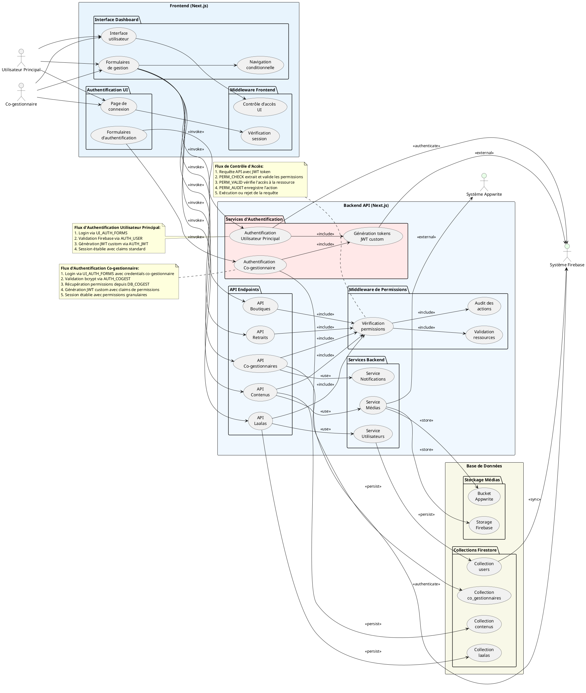

# ⚙️ DIAGRAMME CAS D'UTILISATION - SYSTÈME ET INTERACTIONS TECHNIQUES

## Diagramme PlantUML - Architecture Système et Interactions



## Architecture Technique du Système

### **🏗️ Stack Technologique**

#### **Frontend (Next.js 14)**
```typescript
// Structure des composants principaux
├── app/
│   ├── layout.tsx              // Layout principal avec AuthContext
│   ├── auth/page.tsx           // Page d'authentification unifiée
│   ├── dashboard/              // Interface dashboard protégée
│   └── api/                    // API Routes Next.js
├── components/
│   ├── auth/                   // Composants d'authentification
│   ├── forms/                  // Formulaires de gestion
│   └── dashboard/              // Interface utilisateur dashboard
└── contexts/
    └── AuthContext.tsx         // Gestion état authentification
```

#### **Backend API (Next.js API Routes)**
```typescript
// Services et middleware
├── app/Backend/
│   ├── services/
│   │   └── auth/CoGestionnaireAuthService.ts
│   ├── middleware/
│   │   └── PermissionMiddleware.ts
│   └── types/                  // Définitions TypeScript
└── app/api/
    ├── auth/                   // Endpoints authentification
    ├── laalas/                 // API gestion laalas
    ├── contenus/               // API gestion contenus
    └── co-gestionnaires/       // API gestion co-gestionnaires
```

### **🔄 Flux de Données et Sécurité**

#### **1. Authentification Dual-Mode**
```
Utilisateur Principal:
Firebase Auth → JWT Standard Claims → Session Complète

Co-gestionnaire:
Credentials → bcrypt Validation → JWT Custom Claims → Session Limitée
```

#### **2. Système de Permissions Granulaires**
```typescript
interface ResourcePermission {
  resource: 'laalas' | 'contenus' | 'communications' | 'campaigns';
  actions: {
    create: boolean;
    read: boolean;
    update: boolean;
    delete: boolean;
  };
}
```

#### **3. Middleware de Sécurité**
```
Requête API → JWT Validation → Permission Check → Resource Access → Audit Log
```

### **🗄️ Architecture Base de Données**

#### **Firebase Firestore Collections**
- `users/` - Données utilisateurs principaux
- `laalas/` - Contenus laalas avec owner_id
- `contenus/` - Médias et contenus avec owner_id  
- `co_gestionnaires/` - Profils et permissions co-gestionnaires
- `boutiques/` - Boutiques (accès propriétaire uniquement)
- `retraits/` - Demandes retrait (accès propriétaire uniquement)

#### **Stockage Médias**
- **Firebase Storage** - Stockage principal des médias
- **Appwrite Bucket** - Stockage alternatif configuré

### **📊 Patterns d'Architecture**

#### **Frontend Patterns**
- **Context API** - Gestion état authentification globale
- **Conditional Rendering** - Interface adaptive selon permissions
- **Form Unification** - Composants réutilisables entre dashboard et test

#### **Backend Patterns**
- **Middleware Chain** - Vérification permissions en cascade
- **Service Layer** - Services métier découplés
- **Repository Pattern** - Abstraction accès données

#### **Security Patterns**
- **JWT Custom Claims** - Permissions embarquées dans tokens
- **Resource-Based Access Control (RBAC)** - Contrôle granulaire
- **Audit Trail** - Traçabilité complète des actions

---

*Diagramme technique montrant l'architecture complète du système, les interactions entre composants, et les flux de données avec sécurité intégrée.*
