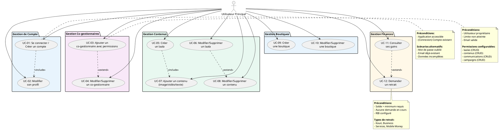

# 👤 DIAGRAMME CAS D'UTILISATION - UTILISATEUR PRINCIPAL

## Diagramme PlantUML - Utilisateur Principal

## Description des Relations

### **Relations Directes (Association)**
- **Utilisateur Principal** interagit directement avec tous les cas d'utilisation
- Chaque UC représente une fonctionnalité accessible via le dashboard

### **Relations Include (<<include>>)**
- **UC-01 → UC-02** : Après connexion/création, modification du profil souvent nécessaire
- **UC-05 → UC-07** : Créer un laala implique généralement d'ajouter du contenu

### **Relations Extend (<<extend>>)**
- **UC-04 ← UC-03** : Modifier/Supprimer est une extension de l'ajout de co-gestionnaires
- **UC-08 ← UC-07** : Modifier/Supprimer contenu étend l'ajout de contenu
- **UC-12 ← UC-11** : Demander retrait est une extension de la consultation des gains

### **Packages Fonctionnels**
- **Gestion de Compte** : Authentification et profil utilisateur
- **Gestion Co-gestionnaires** : Délégation et permissions
- **Gestion Contenus** : Création et gestion des laalas/contenus
- **Gestion Boutiques** : Commerce et vitrine
- **Gestion Finances** : Revenus et retraits

---

*Diagramme PlantUML pour l'acteur Utilisateur Principal avec 12 cas d'utilisation essentiels.*
