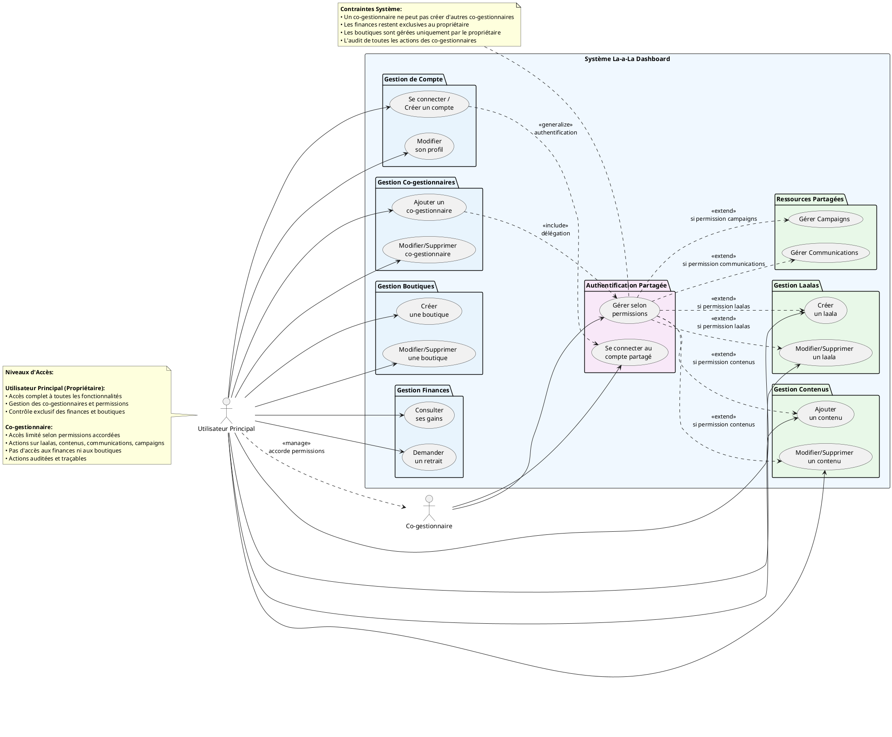

# 🌐 DIAGRAMME CAS D'UTILISATION - VUE D'ENSEMBLE

## Diagramme PlantUML - Vue d'Ensemble du Système



## Architecture des Acteurs et Permissions

### **🔐 Hiérarchie des Acteurs**

```
Utilisateur Principal (Propriétaire)
    ├── Contrôle total du système
    ├── Gestion des co-gestionnaires  
    ├── Accès exclusif : Finances, Boutiques
    └── Audit des actions des co-gestionnaires
    
Co-gestionnaire(s)
    ├── Authentification partagée
    ├── Permissions granulaires par ressource
    ├── Actions limitées selon autorisations
    └── Traçabilité complète des opérations
```

### **📊 Matrice d'Accès Fonctionnel**

| Fonctionnalité | Utilisateur Principal | Co-gestionnaire |
|----------------|----------------------|-----------------|
| **Authentification** | ✅ Complète | 🔒 Partagée avec permissions |
| **Profil** | ✅ Modification complète | ❌ Lecture seule du propriétaire |
| **Co-gestionnaires** | ✅ CRUD complet | ❌ Aucun accès |
| **Laalas** | ✅ CRUD complet | 🔒 Selon permissions accordées |
| **Contenus** | ✅ CRUD complet | 🔒 Selon permissions accordées |
| **Communications** | ✅ CRUD complet | 🔒 Selon permissions accordées |
| **Campaigns** | ✅ CRUD complet | 🔒 Selon permissions accordées |
| **Boutiques** | ✅ CRUD complet | ❌ Aucun accès |
| **Finances** | ✅ Consultation + Retraits | ❌ Aucun accès |

### **🎯 Packages Fonctionnels**

#### **Exclusifs Utilisateur Principal (USER_COLOR)**
- Gestion de compte et profil
- Gestion des co-gestionnaires
- Gestion des boutiques
- Gestion des finances

#### **Partagés avec Permissions (SHARED_COLOR)**
- Gestion des laalas
- Gestion des contenus
- Communications
- Campaigns

#### **Spécifiques Co-gestionnaire (CGEST_COLOR)**
- Authentification partagée
- Système de permissions

---

*Diagramme PlantUML de vue d'ensemble montrant les interactions entre les deux acteurs principaux et leurs accès différenciés au système.*
